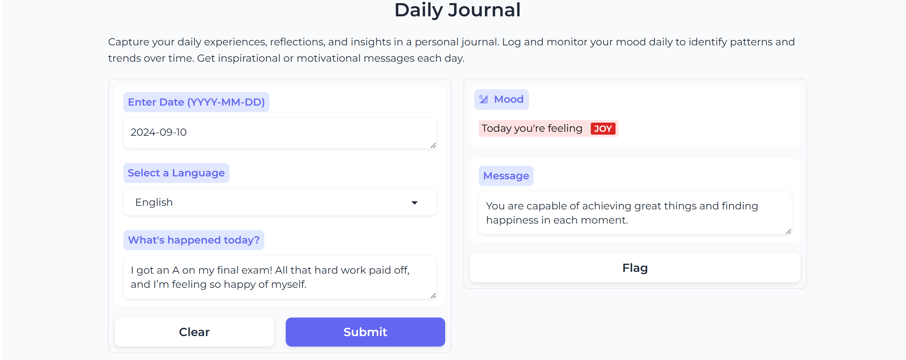
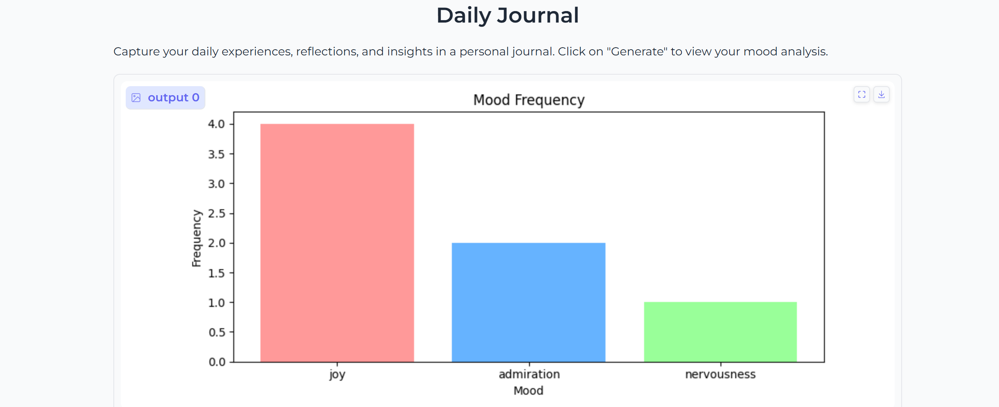
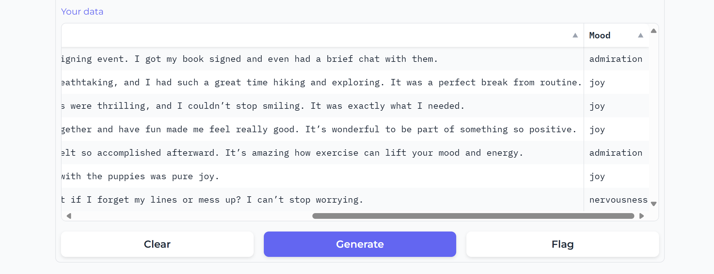

# Mood-Tracker

## Purpose
This project is a mood tracker application that allows users to log their daily experiences in various languages, classify their mood based on their text entries, and receive motivational messages. The project utilizes a combination of [Hugging Face pipelines](https://huggingface.co/models), [OpenAI GPT-3.5-turbo API](https://beta.openai.com/docs/models/gpt-3-5), and [Gradio](https://gradio.app/) for a seamless and interactive user interface.

## Main Files and Their Functions
1. **`Mood-Tracker-Application.ipynb`**: This comprehensive file includes all key functionalities:
   - **Mood Classifier**: Uses the `SamLowe/roberta-base-go_emotions` model from Hugging Face's text-classification pipeline to categorize the user’s input into emotional labels. [Model details](https://huggingface.co/SamLowe/roberta-base-go_emotions)
   - **Translator**: Handles non-English input using the `facebook/nllb-200-distilled-600M` model from Hugging Face's translation pipeline. It translates text into English before classification. [Translation model](https://huggingface.co/facebook/nllb-200-distilled-600M)
   - **OpenAI GPT-3.5 API**: After mood classification, the OpenAI API generates personalized motivational feedback based on the detected mood. [API Documentation](https://beta.openai.com/docs/models/gpt-3-5)
   - **Gradio Interface**: Provides an easy-to-use interface for users to input the date, language, and journal entry, then displays the classified mood and a motivational message. [Gradio Documentation](https://gradio.app/docs/)
   - **Data Storage & Analysis**: Stores user entries (date, text, mood) in a pandas DataFrame. Includes a function that visualizes mood trends over time by generating a bar chart of mood frequencies.

2. **`Mood-Tracker-Pipeline.ipynb`**: Focuses on Hugging Face pipelines, the OpenAI API while also involving data storage/analysis.

3. **`Mood-Tracker-Gradio.ipynb`**: Emphasizes the Gradio components while also involving data storage and analysis.

## Hugging Face Text-to-Text Pipeline

This project utilizes two Hugging Face pipelines:
1. **Text Classification**: The text-classification pipeline is powered by a pre-trained RoBERTa model (`SamLowe/roberta-base-go_emotions`), which classifies input text into one of several emotional labels. The pipeline returns the most likely emotion along with its confidence score. [Hugging Face Text Classification](https://huggingface.co/models?pipeline_tag=text-classification)
2. **Translation**: For multilingual support, the translation pipeline is used. The `facebook/nllb-200-distilled-600M` model translates user inputs from non-English languages to English. The translation task is specified using source and target language codes (e.g., from Arabic to English: `arb_Arab -> eng_Latn`). [Hugging Face Translation Pipeline](https://huggingface.co/models?pipeline_tag=translation)

The system first translates non-English text to English before passing it to the classifier, ensuring all text is analyzed in a uniform language.

## Instructions to Run the Code

1. **Prerequisites**: Install the required dependencies:
   - Gradio
   - openai
   - python-dotenv
   - transformers
   - pandas
   - matplotlib
3. **Set Up OpenAI API Key**
4. **Run the Application**: Execute the Python script. The Gradio interface will launch automatically in your browser
5. **Using the Application**: Install the required dependencies:
   - Enter the date (YYYY-MM-DD format).
   - Select the input language from the dropdown menu (English, French, Arabic, Spanish, German, Chinese, Hindi).
   - Describe what happened today in the textbox.
   - The application will classify your mood, display the result, and generate a personalized message.
6. **View Mood Trends**: After logging some entries, click the "Generate" button to view a bar chart that visualizes the frequency of different moods over time.

## Expected Output from Gradio Interface
- **Input:**
  - Date: e.g., "2024-09-12"
  - Language: e.g., "French"
  - Text: e.g., "Je me sens fatigué aujourd'hui."
- **Outputs:**
  - Mood Classification: e.g., "Today you're feeling sadness"
  - Message: e.g., "It's okay to feel down sometimes, but remember that better days are ahead."

Mood Tracker Main Gradio Interface - Demonstration of Inputs and Outputs

- **Mood Analysis:** When clicking the "Generate" button, a bar chart representing the distribution of moods will be displayed along with a table of the user’s data.

This bar chart illustrates the distribution of moods recorded by the user. Each bar represents the frequency of a specific mood.

The table displays the user's mood entries, including the date, language, text, and mood of each journal entry.

## Links
[Mood Tracker Space](https://huggingface.co/MoodTracker-team)

[Watch the video](https://drive.google.com/file/d/1kn9-SZzoE44kIwY_P85VZPZI2aVgHbb6/view?usp=sharing)

## Authors
- **[Shahad Albalawi]**
- **[Nojood Alnahdi]**
